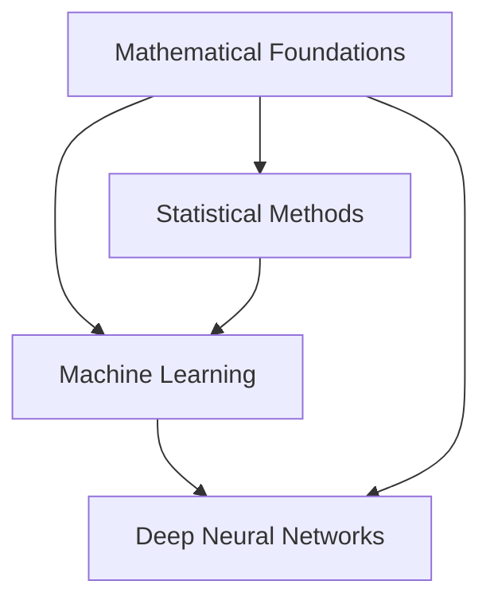

# Semester 1 Overview

Welcome to the Semester 1 knowledge base! This semester focuses on building strong foundations in mathematics, statistics, and core machine learning concepts.

## 🎯 Semester Goals

The first semester is designed to:

- Establish mathematical foundations essential for ML
- Understand deep learning architectures and training
- Master statistical methods for data analysis
- Learn fundamental machine learning algorithms and techniques

## 📚 Course List

### Core Courses

| Course | Code | Focus Area | Credits |
|--------|------|------------|---------|
| [Mathematical Foundations for ML](mathematical-foundations.md) | S1-25_AIMLCZC416 | Linear Algebra, Calculus, Optimization | - |
| [Deep Neural Networks](deep-neural-networks.md) | S1-25_AIMLCZG511 | Neural Networks, Deep Learning | - |
| [Introduction to Statistical Methods](statistical-methods.md) | S1-25_AIMLCZC418 | Probability, Statistics, Inference | - |
| [Machine Learning](machine-learning.md) | S1-25_AIMLCZG565 | ML Algorithms, Model Evaluation | - |

## 📈 Learning Path

## 🎓 Key Concepts

This semester covers several interconnected areas:

1. **Mathematical Foundations**: The language of ML
2. **Statistical Methods**: Understanding data and uncertainty
3. **Machine Learning**: Core algorithms and techniques
4. **Deep Learning**: Advanced neural network architectures

## 📖 Quick Links

- [Mathematical Foundations](mathematical-foundations.md)
- [Deep Neural Networks](deep-neural-networks.md)
- [Statistical Methods](statistical-methods.md)
- [Machine Learning](machine-learning.md)

---

*Navigate to individual course pages to explore detailed content, notes, and resources.*
