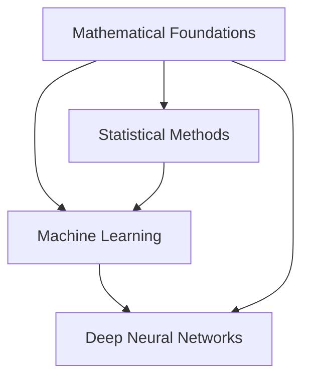

# Semester 1 Overview

Welcome to the Semester 1 knowledge base! This semester focuses on building strong foundations in mathematics, statistics, and core machine learning concepts.

## 🎯 Semester Goals

The first semester is designed to:

- Establish mathematical foundations essential for ML
- Understand deep learning architectures and training
- Master statistical methods for data analysis
- Learn fundamental machine learning algorithms and techniques

## 📚 Course List

### Core Courses

| Course | Code | Focus Area | Credits |
|--------|------|------------|---------|
| [Mathematical Foundations for ML](mathematical-foundations.md) | S1-25_AIMLCZC416 | Linear Algebra, Calculus, Optimization | - |
| [Deep Neural Networks](deep-neural-networks.md) | S1-25_AIMLCZG511 | Neural Networks, Deep Learning | - |
| [Introduction to Statistical Methods](statistical-methods.md) | S1-25_AIMLCZC418 | Probability, Statistics, Inference | - |
| [Machine Learning](machine-learning.md) | S1-25_AIMLCZG565 | ML Algorithms, Model Evaluation | - |

## 📈 Learning Path

```mermaid
graph TD
    A[Mathematical Foundations] --> B[Statistical Methods]
    A --> C[Machine Learning]
    B --> C
    C --> D[Deep Neural Networks]
    A --> D
```

## 🎓 Key Concepts

This semester covers several interconnected areas:

1. **Mathematical Foundations**: The language of ML
2. **Statistical Methods**: Understanding data and uncertainty
3. **Machine Learning**: Core algorithms and techniques
4. **Deep Learning**: Advanced neural network architectures

## 📖 Quick Links

- [Mathematical Foundations](mathematical-foundations.md)
- [Deep Neural Networks](deep-neural-networks.md)
- [Statistical Methods](statistical-methods.md)
- [Machine Learning](machine-learning.md)

---

## 📝 Blogs & Good Reads

### 🎯 Must-Read Collections

:::info "📄 Research Papers & Collections"
    - 🌟 **[Must-Read Papers for ML/DL](https://github.com/hurshd0/must-read-papers-for-ml)** - Curated collection of essential papers
      - Topics: Neural Networks, CNNs, RNNs, GANs, Transformers, NLP, Computer Vision
      - Includes foundational papers with reading priority rankings (🥇🥈🥉)
      - Community-driven with 1.3k+ stars
    
    *Add more paper collections as you discover them*

:::info "📰 Blogs & Articles"
    *Add your favorite ML/AI blogs and articles here*
    
    - Example categories:
      - Technical deep-dives
      - Industry insights
      - Research updates
      - Tutorials and guides

:::info "🔗 Useful Resources & Links"
    *Add other useful learning resources here*
    
    - Online courses
    - Interactive tutorials
    - Tools and frameworks
    - Community forums

---

*Navigate to individual course pages to explore detailed content, notes, and resources.*
